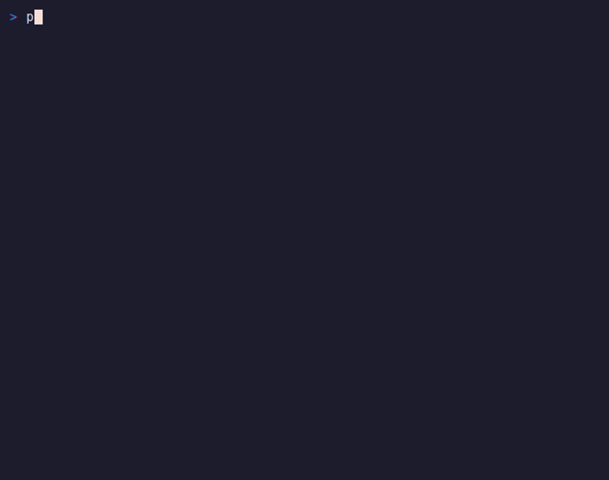

# portside

A terminal file explorer for remote machines. It connects over plain SSH
(nothing to install on the server), shows the remote filesystem as a tree,
pulls files down to your machine with one key, and forwards ports like VS
Code's Ports panel. It's built to sit in a split next to
[Claude Code](https://claude.com/claude-code) — the `work` command opens both
panes at once — but it's useful on its own too.



I made this because my actual workday was: a terminal with an AI session on a
server, a second terminal for scp, and a VS Code remote window I only opened
to click "download" on some file. That's three tools for one job. portside is
the one tool: browse the server, grab the file, forward the port, and hand
file paths straight to the Claude pane next door (`c` types the selected path
into it).

## Install

Linux and macOS:

```sh
curl -fsSL https://raw.githubusercontent.com/Mapika/portside/main/install.sh | sh
```

Needs tmux for the split layout (`apt install tmux` / `brew install tmux`).

Windows (PowerShell):

```powershell
irm https://raw.githubusercontent.com/Mapika/portside/main/install.ps1 | iex
```

Needs [Windows Terminal](https://aka.ms/terminal); the split uses `wt` panes
instead of tmux, so there's no session reattach on Windows. Hosts and keys
come from your Windows `~/.ssh/config` and the Windows OpenSSH agent.

## Usage

```sh
work            # local workspace: portside left, claude right
work <host>     # remote workspace: browse <host>, claude runs on it via ssh
work <dir>      # local workspace in that directory
portside --host <host>   # just the explorer, no claude pane
```

`<host>` is any Host alias from your `~/.ssh/config`. Auth uses your SSH
agent and unencrypted key files — if `ssh <host>` works without a password
prompt, portside works. Nothing runs on the server (in remote `work` mode,
Claude Code does — install it there first).

Downloads go to `~/Downloads` by default (`C:\Users\<you>\Downloads` on
Windows); the `save to:` prompt remembers what you last typed.

## Keys

| Key | Action |
| --- | --- |
| `↑/↓` `j/k` | move |
| `enter` | expand/collapse folder |
| `:` or `Ctrl+L` | type a path to jump to |
| `Ctrl+H` | switch host (local / ~/.ssh/config hosts) |
| `d` | download selected file/folder |
| `c` | send the selected path to the Claude pane (clipboard if no tmux) |
| `r` | refresh |
| `.` | toggle hidden files |
| `R` | reconnect current host |
| `Ctrl+P` | toggle Ports view |
| `a` / `x` | (Ports) add / stop a forward |
| `q` / `Ctrl+C` | quit |

## Notes

- The demo gif is scripted and reproducible: `demo/record.sh` (needs
  [vhs](https://github.com/charmbracelet/vhs)). The "server" in it is a
  throwaway SSH server from `demo/sshserver`, so no real machines were
  harmed.
- Not yet supported, planned: passphrase-protected keys without an agent,
  password auth, ProxyJump/bastion hosts, file rename/delete/upload. If one
  of these blocks you, open an issue so I know what to do first.
